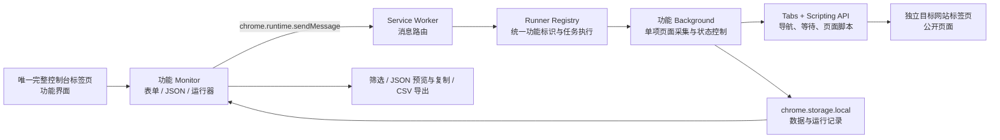

# BrowserCoreClaw

> 面向公开网页信息的 Chrome 本地控制台采集工具箱。以平台分组、独立功能目录和 JSON 配置驱动，帮助在当前浏览器 Profile 中执行可追踪、可导出的采集任务。

BrowserCoreClaw 是一个 [Chrome Manifest V3](https://developer.chrome.com/docs/extensions/develop/migrate/what-is-mv3) 扩展。它不依赖业务后端：功能界面作为 Chrome 中唯一的完整控制台标签页运行；后台会为采集任务新开独立的目标网站标签页，等待页面稳定后读取公开可见内容；任务记录与采集结果保存在 `chrome.storage.local`。

> 当前处于 Beta 阶段。各平台页面结构、登录状态与风控策略可能变化；请仅在遵守目标平台规则、法律法规及数据使用边界的前提下使用。

## 目录

- [核心能力](#核心能力)
- [支持的平台与功能](#支持的平台与功能)
- [工作原理](#工作原理)
- [快速开始](#快速开始)
- [数据、权限与安全边界](#数据权限与安全边界)
- [项目结构](#项目结构)
- [开发与扩展](#开发与扩展)
- [限制与排查](#限制与排查)
- [功能文档](#功能文档)

## 核心能力

- **平台化功能目录**：按 Google、微博、抖音、小红书等数据来源平台组织；首页从 JSON 配置动态生成。
- **唯一控制台入口**：重复点击扩展图标会定位到同一个完整控制台标签页，不会重复创建功能界面；采集网站页面与控制台分离。
- **独立任务执行**：关键词、主页链接或内容链接均可逐条或批量输入；输入超过 10 条时按页展示，批量编辑与任务运行仍处理完整列表；每批默认按顺序执行（并发数为 1），可按需提高至最多 3 个独立后台标签页任务；运行中的功能可切换到其他功能，任务会在后台继续执行。
- **三种参数入口**：全部功能均提供“表单 / JSON / 运行器”页签。JSON 模式用于编辑普通运行参数；运行器模式展示带 `featureId` 的完整任务配置，可直接校验、创建、停止并跟踪后台任务。
- **统一功能 Runner**：每项功能都以 `groupId/featureId` 注册独立 Runner，统一支持参数校验、批量并发、随机间隔、单项超时、停止、进度、标准结果和可选的数据写入；功能页面手动执行与功能间调用使用同一个后台入口。
- **固定调用关系**：设置页提供“运行器”标签，可为任一来源功能配置多个允许调用的目标 Runner；当前只维护可调用白名单，为后续跨功能编排提供稳定配置，不会自动触发下游任务。
- **页面稳定性控制**：在读取前等待目标区域、筛选状态或滚动加载结果稳定，降低“页面尚未刷新完成即采集”的概率。
- **可控采集节奏**：主页类和关键词类功能支持随机间隔；支持循环监控的功能可按轮次持续运行，直至手动停止。
- **可选数据覆盖**：全部功能的运行选项均提供“强制更新数据”；默认按唯一键去重并保留已有记录，勾选后以本轮同键采集结果覆盖旧数据，不会把更新误计为新增。
- **统一运行记录**：普通运行和 Runner 运行写入同一套功能运行记录；可按关键词/链接、状态和类型（普通运行 / 运行器）筛选，并分别展示页面获取的“结果数量”和去重入库的“新增数量”。点击任务编号可查看单次输入项的状态、父 Runner 任务、数量、耗时和错误信息。
- **本地留存与导出**：每项功能的数据最多保留 3,000 条；运行记录按状态最多保留 200 条；数据页支持字段筛选、JSON 弹窗预览与一键复制，以及 UTF-8 BOM CSV 导出。

## 支持的平台与功能

| 平台 | 功能 | 输入 | 登录前置检查 | 主要产出 |
| --- | --- | --- | --- | --- |
| Google | Google 新闻监控 | 关键词 | 不需要 | 最近一小时新闻标题、描述、来源、发布时间、链接 |
| 微博 | 博主博文采集 | 博主主页链接 | 不需要 | 公开博文、互动数据、媒体链接 |
| 微博 | 博主信息采集 | 博主主页链接 | 不需要 | 公开资料、主页互动统计、资料卡详情 |
| 微博 | 正文采集 | 博文链接 | 不需要 | 作者、正文、话题、提及、互动与媒体 |
| 抖音 | 博主博文采集 | 博主主页链接 | 不需要 | 公开作品、封面、点赞与页面顺序 |
| 抖音 | 博主信息采集 | 博主主页链接 | 不需要 | 头像、昵称、账号标识、互动统计与标签 |
| 抖音 | 博文采集 | 作品链接或短链 | 不需要 | 作品详情、作者、话题、互动与媒体 |
| 小红书 | 关键词搜索 | 关键词与页面筛选项 | **需要** | 笔记卡片、作者、发布时间、点赞与链接 |
| 小红书 | 博主博文采集 | 博主主页链接 | **需要** | 主页笔记卡片与页面顺序 |
| 小红书 | 博主信息采集 | 博主主页链接 | **需要** | 公开资料、互动统计、标签与 IP 属地 |
| 小红书 | 正文采集 | 笔记正文链接 | **需要** | 标题、描述、作者、媒体、话题与互动详情 |

“不需要”表示扩展不会在运行前拦截登录状态；这并不代表平台不会要求登录、验证码或其他安全验证。遇到验证时，请在对应站点页面中自行完成处理后再重试。

## 工作原理



每项功能遵循相同的职责边界：

1. **界面层（`index.js` / `monitor.js`）**：维护输入、运行状态、记录和数据表。
2. **运行器层（`runner.js` / `src/runners/registry.js`）**：使用全局唯一功能标识接收完整参数，统一组织批量输入、并发、间隔、超时、停止、进度与结果。
3. **后台层（`background.js`）**：执行单个输入项的目标页采集，通过 Tabs 与 Scripting API 导航和执行页面命令，并处理停止信号与错误；不占用控制台标签页。
4. **页面解析层（`page-extract.js`，按需提供）**：从页面公开 DOM 中读取数据，并判断筛选或列表是否稳定。
5. **筛选与导出层（`data-table-filter.js`、`export-data.js`）**：按表格字段筛选本地结果，复制筛选后的 JSON，并导出筛选后的 CSV。

## 快速开始

### 环境要求

- 最新版 Google Chrome（需支持 Manifest V3、Tabs 与 Scripting API）。
- Node.js 18+（仅用于校验与打包）。

项目没有第三方 npm 依赖；执行以下脚本前无需安装 `node_modules`。

### 以未打包扩展方式加载

1. 克隆或下载本仓库。
2. 在 Chrome 打开 `chrome://extensions/`，开启右上角的“开发者模式”。
3. 点击“加载已解压的扩展程序”，选择本项目根目录。
4. 点击扩展图标，Chrome 会打开 BrowserCoreClaw 完整控制台标签页；重复点击会定位到同一个控制台标签页。
5. 修改源代码、配置或权限后，在扩展管理页点击“重新加载”。

进入任意功能后，可以在运行参数区域选择“运行器”：点击“载入当前参数”生成完整 Runner JSON，校验通过后点击“创建任务”。任务编号、状态、进度、结果数量、新增数量、失败输入和耗时会显示在面板中；离开功能页面后任务仍在后台继续执行。Runner 的每个关键词或链接会实时合并到该功能原有的“运行记录”，类型显示为“运行器”，而从表单直接启动的记录显示为“普通运行”。运行选项中的“强制更新数据”会同步写入 JSON 和 Runner 配置：不勾选时同键数据保留旧值，勾选后才以本次结果覆盖。

### 校验与打包

```bash
# 校验 Manifest、功能配置、入口文件与关键采集逻辑
npm run check

# 先执行校验，再输出可分发扩展包
npm run package
```

打包产物为 `dist/BrowserCoreClaw-<version>.zip`。打包脚本会重新生成 `dist/` 目录，请勿在其中保存手工文件。

> 使用 `python3 -m http.server` 等静态服务器打开 `sidepanel.html` 仅能预览界面；实际采集、登录检测、标签页控制与本地存储必须在已加载的 Chrome 扩展中运行。

## 数据、权限与安全边界

### 数据处理

- 采集结果与任务记录使用 `chrome.storage.local` 存储在当前浏览器 Profile 内。
- 当前项目未配置业务服务端或远程数据接口；导出由浏览器本地发起。
- 仅由扩展创建的采集标签页会在成功完成或手动停止后自动关闭；超时、解析失败、登录或验证码等异常页面会保留，便于排查。扩展不会关闭用户原本打开的站点页面。
- 小红书登录由用户在现有 Chrome 会话中自行完成。扩展不代填、不保存平台账号密码。
- 内置功能只读取页面公开可见内容，不执行点赞、评论、转发、关注等互动操作。

### Chrome 权限说明

| 权限 | 用途 |
| --- | --- |
| `storage` | 保存输入配置、运行记录与采集结果。 |
| `tabs` / `activeTab` | 定位唯一控制台标签页，并为每项采集任务创建独立的目标站点标签页。 |
| `scripting` | 在已授权的平台页面中执行自包含的 DOM 读取与交互命令，不建立调试会话。 |
| 站点 Host Permissions | 允许扩展在 Google、小红书、微博和抖音的已声明域名中执行采集流程。 |

全部采集功能均使用普通标签页与 `scripting` 权限，不申请 `debugger` 权限，也不会显示 Chrome 的“已开始调试此浏览器”提示。

## 项目结构

```text
BrowserCoreClaw/
├── manifest.json                         # Manifest V3、权限、标签页入口与后台入口
├── sidepanel.html                        # 扩展完整控制台页面
├── src/
│   ├── app/                              # 首页、配置加载、功能路由与通用样式
│   ├── background/                       # Service Worker 消息路由、标签页脚本客户端
│   ├── config/groups.json                # 平台分组与功能入口的唯一配置源
│   ├── runners/                           # Runner 注册表
│   ├── groups/
│   │   └── <platform>/<feature>/          # 每项功能的独立实现目录
│   │       ├── index.js                  # 功能挂载入口
│   │       ├── monitor.js                # 页面状态、任务记录与数据界面
│   │       ├── runner.js                 # 标准功能运行器
│   │       ├── background.js             # 后台采集任务（按需）
│   │       ├── page-extract.js           # 页面稳定性与数据解析（按需）
│   │       ├── export-data.js            # JSON 序列化 / CSV 数据导出（按需）
│   │       ├── constants.js              # 消息类型与功能常量（按需）
│   │       └── styles.css                # 功能私有样式
│   └── shared/                           # 跨功能复用的任务明细等能力
├── doc/<platform>/<feature>.md           # 每项功能的使用与字段说明
├── scripts/
│   ├── validate.mjs                      # 配置、语法与关键逻辑校验
│   └── package-extension.sh              # 扩展打包脚本
└── dist/                                 # 本地构建产物（自动生成）
```

## 开发与扩展

### 功能配置

`src/config/groups.json` 是功能目录的唯一配置源。每个功能需要声明平台、名称、简介、模块入口与样式入口；首页会据此生成分组、搜索结果与功能路由。

```json
{
  "id": "feature-id",
  "name": "功能名称",
  "description": "显示在首页问号提示中的功能简介",
  "runner": "src/groups/<platform>/<feature>/runner.js",
  "entry": "src/groups/<platform>/<feature>/index.js",
  "style": "src/groups/<platform>/<feature>/styles.css"
}
```

平台分组按**数据来源平台**划分，而不是按搜索、监控或导出等能力划分。

### 新增一项采集功能

1. 在 `src/groups/<platform-id>/<feature-id>/` 新建独立功能目录，并在 `index.js` 中导出 `mount(container, context)`。
2. 按需要实现 `monitor.js`、`runner.js`、`background.js`、`page-extract.js`、`export-data.js`、`constants.js` 与 `styles.css`。
3. 在 `src/config/groups.json` 注册 `runner`、`entry` 和 `style`；这些文件必须位于该功能的独立目录内。
4. 在 `src/runners/registry.js` 注册 Runner；单项采集消息仍由 `src/background/service-worker.js` 负责路由。
5. 在 `doc/<platform-id>/<feature-id>.md` 补充功能目的、输入、流程、字段、数据留存和注意事项，并在本 README 的功能表中登记。
6. 执行 `npm run check`；通过后重新加载扩展并进行真实页面回归测试。

### 代码约定

- 使用原生 ES Modules，不引入构建框架或运行时依赖。
- 每项功能的数据结构、存储键、消息类型和页面选择器应保持在功能目录内，避免跨平台耦合。
- 页面 DOM 变化时，优先更新解析与稳定性判断，不要用固定延时替代状态确认。
- 新增 Host Permission 时，应审查权限范围，并在 `chrome://extensions/` 重新加载扩展后确认授权。

## 限制与排查

| 现象 | 优先检查 |
| --- | --- |
| 运行后未获取数据 | 目标页面是否已完成登录、验证码或安全验证；页面公开内容是否可见。 |
| 页面脚本无法执行 | 确认目标地址属于 manifest 已授权域名，并在权限变化后重新加载扩展。 |
| 筛选后数据仍是旧结果 | 等待页面筛选状态与结果列表稳定；如站点改版，更新对应的 `page-extract.js`。 |
| 点击扩展图标未打开或定位控制台 | 在 `chrome://extensions/` 重新加载扩展，并检查 Service Worker 控制台错误。 |
| 静态预览可打开但采集失败 | 确认是在已加载的扩展中运行，而非普通 HTTP 页面。 |

## 功能文档

| 平台 | 功能 | 说明 |
| --- | --- | --- |
| Google | Google 新闻监控 | [查看文档](doc/google/google-news.md) |
| 微博 | 博主博文采集 | [查看文档](doc/weibo/profile-posts.md) |
| 微博 | 博主信息采集 | [查看文档](doc/weibo/profile-info.md) |
| 微博 | 正文采集 | [查看文档](doc/weibo/post-detail.md) |
| 抖音 | 博主博文采集 | [查看文档](doc/douyin/profile-posts.md) |
| 抖音 | 博主信息采集 | [查看文档](doc/douyin/profile-info.md) |
| 抖音 | 博文采集 | [查看文档](doc/douyin/post-detail.md) |
| 小红书 | 关键词搜索 | [查看文档](doc/xiaohongshu/keyword-search.md) |
| 小红书 | 博主博文采集 | [查看文档](doc/xiaohongshu/profile-notes.md) |
| 小红书 | 博主信息采集 | [查看文档](doc/xiaohongshu/profile-info.md) |
| 小红书 | 正文采集 | [查看文档](doc/xiaohongshu/post-detail.md) |

---

如需新增平台、功能或字段，请先以 `groups.json`、对应功能目录和 `doc/` 中的同类实现为模板，保持“平台分组 / 独立功能目录 / 独立功能文档”的结构一致。
